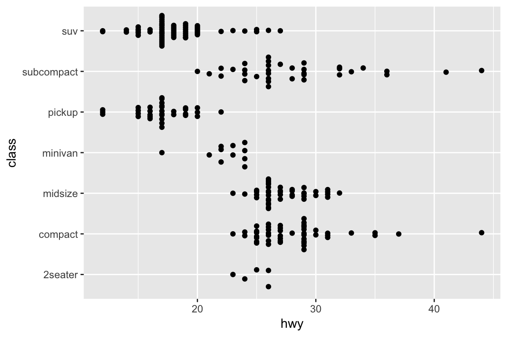
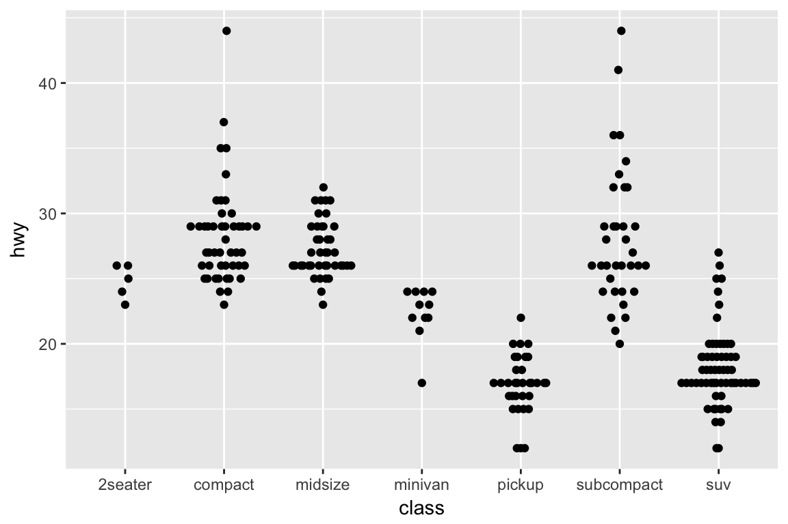
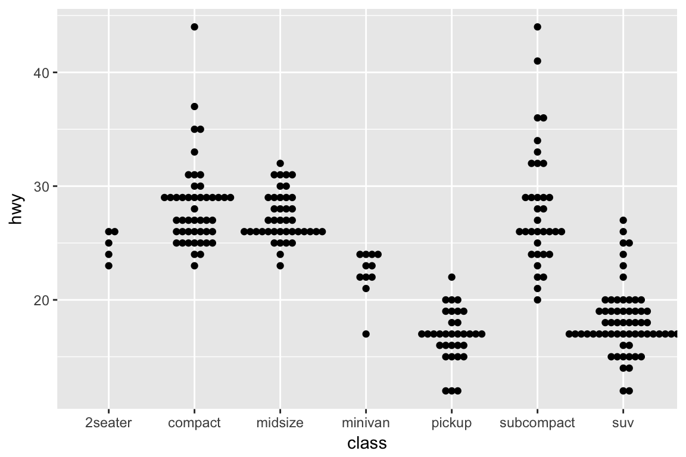
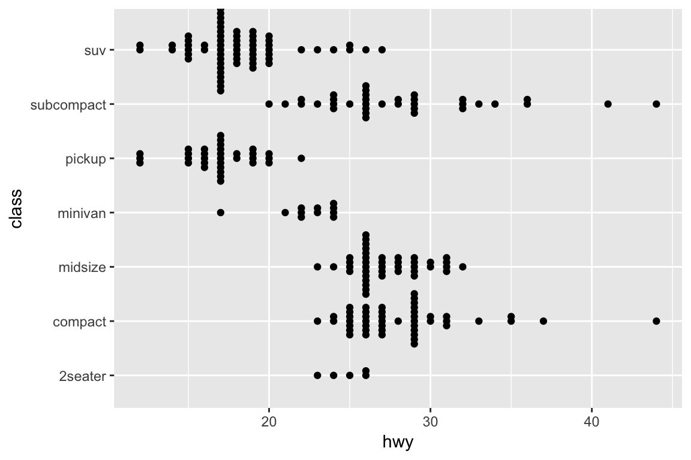
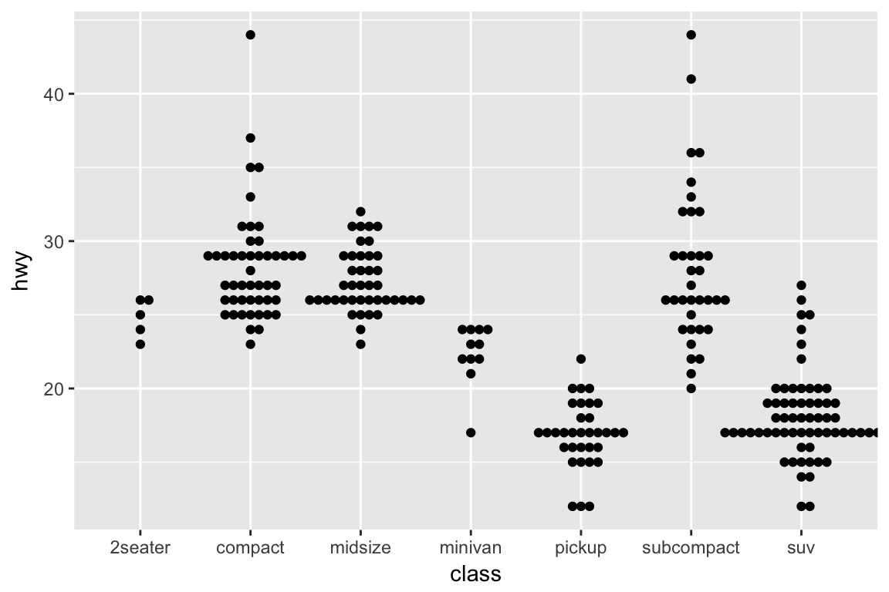
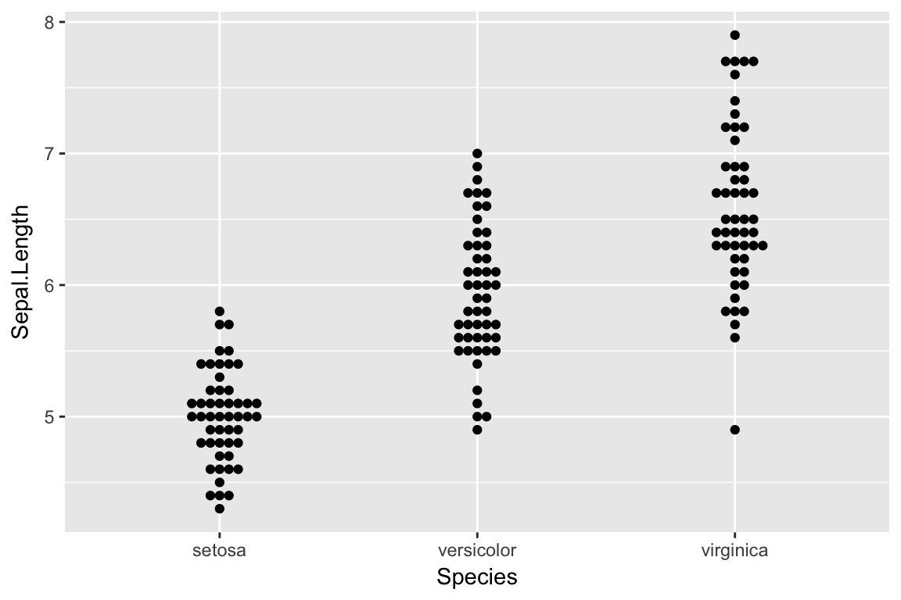

# Beeswarm-style plots with ggplot2

## Introduction
Beeswarm plots (aka column scatter plots or violin scatter plots) are a way of plotting points that would ordinarily overlap so that they fall next to each other instead. In addition to reducing overplotting, it helps visualize the density of the data at each point (similar to a violin plot), while still showing each data point individually.

`ggbeeswarm` provides two different methods to create beeswarm-style plots using [ggplot2](http://ggplot2.org). It does this by adding two new ggplot Geom objects:

- `geom_quasirandom`: Uses a [van der Corput sequence](http://en.wikipedia.org/wiki/Van_der_Corput_sequence) to space the dots to avoid overplotting. This uses [sherrillmix/vipor](https://github.com/sherrillmix/vipor).

- `geom_beeswarm`: Uses the [beeswarm](https://cran.r-project.org/web/packages/beeswarm/index.html) library to do point-size based offset. 

See the examples below.


## Installation


```r
# And until this package is on CRAN:
devtools::install_github("eclarke/ggbeeswarm")
```

## Examples

### geom_quasirandom()

Using `geom_quasirandom`:

```r
set.seed(12345)
library(ggplot2)
library(ggbeeswarm)
qplot(Species, Sepal.Length, data=iris)+ geom_quasirandom()
```

 

```r
qplot(class, hwy, data=mpg, geom="quasirandom")
```

 

```r
# With categorical y-axis
qplot(hwy, class, data=mpg, geom='quasirandom')
```

 

```r
# Some groups may have only a few points. Use `varwidth=TRUE` to adjust width dynamically.
qplot(class, hwy, data=mpg) + geom_quasirandom(varwidth = TRUE)
```

 

### geom_beeswarm()

Using `geom_beeswarm`:

```r
qplot(Species, Sepal.Length, data=iris) + geom_beeswarm()
```

 

```r
qplot(class, hwy, data=mpg, geom='beeswarm')
```

 

```r
# With categorical y-axis
qplot(hwy, class, data=mpg, geom='beeswarm')
```

 

```r
# ggplot doesn't pass any information about the actual device size of the points
# to the underlying layout code, so it's important to manually adjust the `cex` 
# parameter for best results
qplot(class, hwy, data=mpg)+ geom_beeswarm(cex=5)
```

 

```r
qplot(Species, Sepal.Length, data=iris) +geom_beeswarm(cex=4,priority='density')
```

 


------
Authors: Erik Clarke and Scott Sherrill-Mix

